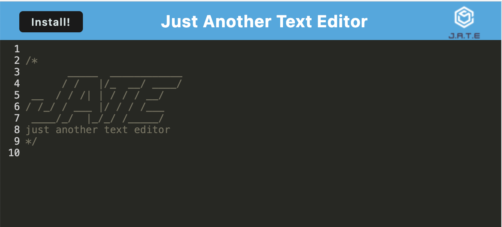

# Just Another Text Editor

## Description 

For this project I had to take a simple text editor and implement methods for getting and storing data to an **IndexedDB** database. Together with static asset caching and Local storage as a data backup, the application could then function without an internet connection.

This was a challenging task involving creating a service worker with **Workbox** to cache static assets, bundling with **Webpack**, and employing **Babel** to make the JavaScript code backwards compatible in older browsers. Finally, the application had to generate a ```manifest.json``` file using the **WebpackPwaManifest** plugin, so that it could be installed as a **Progressive Web Application**.

My project is deployed on [Heroku](https://www.heroku.com/) at this [link](https://floating-eyrie-53578-efda4f2185f3.herokuapp.com/).


## Installation

To install locally for development purposes, copy the files and folders from the repo into the desired directory.

From the root folder, install dependencies with the command
```
npm install
```

Alternatively, the application can be run from its deployed location, [here](https://floating-eyrie-53578-efda4f2185f3.herokuapp.com/).

## Usage 

If installed locally for development purposes, the webpack can be built and the application started with a single script command:
```
npm run start
```
Then, the user can simply navigate to ```http://localhost:3000/``` and use the app.

Text can be input on any line. The text is saved to both Local storage and IndexedDB whenever the editor window loses focus. In this way it does not require an internet connection after its first load.

Additionally, the application be installed as a *Progressive Web Application* by clicking on the **Install!** button. 

See a screenshot of the application below.




## Credits

I used [Express](https://www.npmjs.com/package/express/v/4.18.2) to manage routing.

I used [idb](https://www.npmjs.com/package/idb) to add functionality to IndexedDB.

I used [Webpack](https://www.npmjs.com/package/webpack) as a module bundler.

I used [Workbox](https://www.npmjs.com/package/workbox-webpack-plugin) to create a service worker.

I used [Babel](https://babeljs.io/) to make JavaScript backward compatible in older browsers.


## License

Please refer to the LICENSE in the repo.

---
